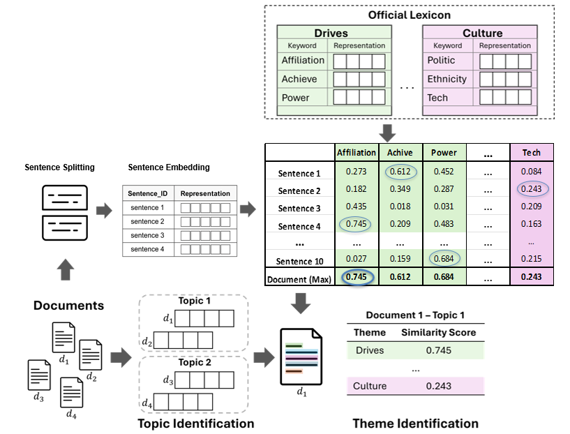
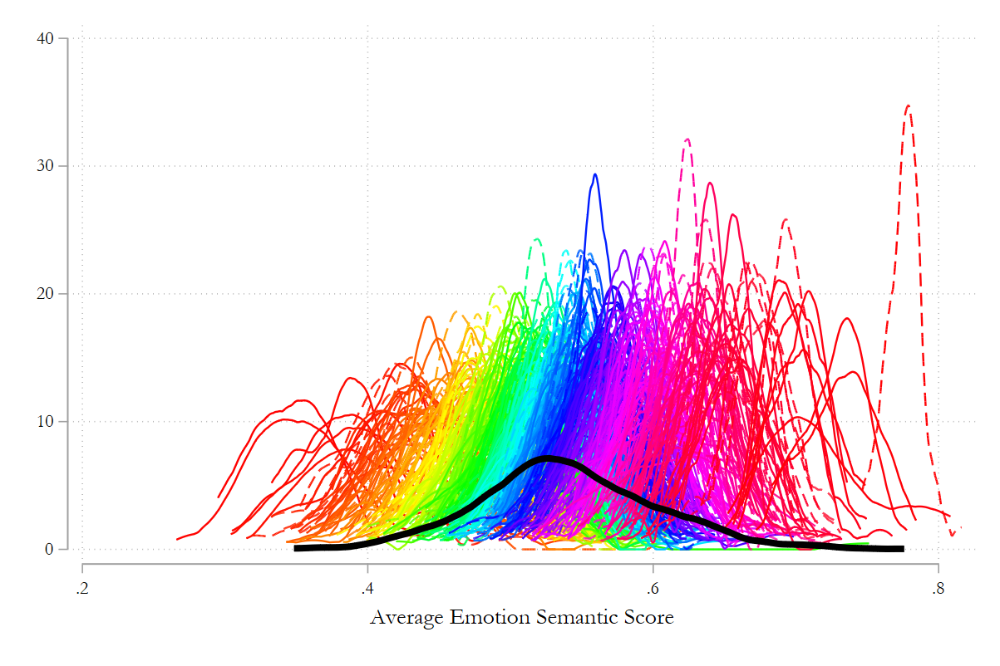
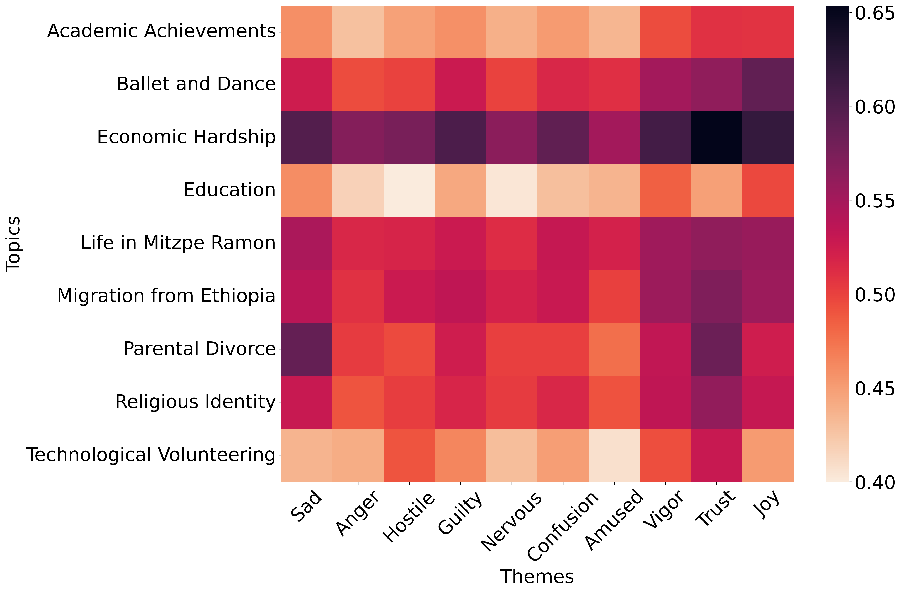
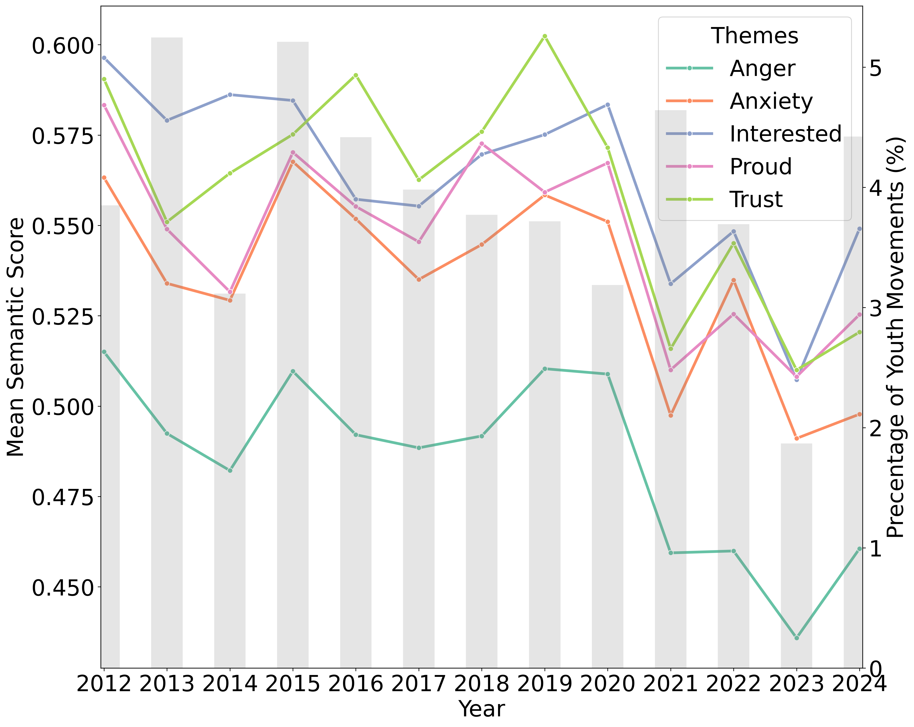
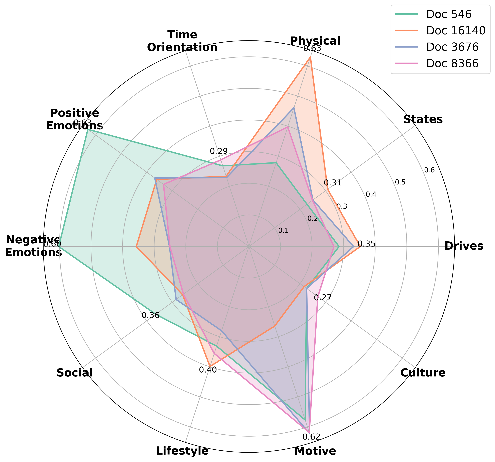

# BET: Detecting Behavioral and Emotional Themes Through Latent and Explicit Knowledge

## Overview
_BET_ presents a method for analyzing large-scale textual data by identifying themes, emotional patterns, and topic distributions within documents. While the method has been tested using a dataset of scholarship applications, its utility extends far beyond this specific use case.

Researchers and analysts working with extensive text corpora can leverage this approach to gain insights into various aspects of textual expression, such as:

- **Social Science Research:** Understanding discourse patterns in interviews, survey responses, or open-ended questionnaires.
- **Historical and Political Analysis:** Investigating changes in rhetoric and sentiment over time in political speeches, policy documents, or historical records.
- **Media and Communication Studies:** Analyzing trends in journalistic writing, news reports, or social media discussions.
- **Corporate and Customer Feedback Analysis:** Examining employee reviews, product feedback, or consumer complaints to extract recurring themes and sentiment shifts.
- **Healthcare and Psychological Studies:** Analyzing patient narratives, therapy session transcripts, or mental health forums for patterns in expression and sentiment.

The method provides a framework for researchers to explore not just the content of texts but also the manner in which ideas are expressed, offering a nuanced view of underlying themes and emotional tones.

This repository contains the code and data for the paper
**Detecting Behavioral and Emotional Themes Through Latent and Explicit Knowledge**.

 
<span style="font-size:16px;"><b>Figure 1:</b> Methodological Framework for Behavioral and Emotional Theme Detection (BET).</span> 


## Features
- **Text Processing**: Tokenization and embedding generation using `SentenceTransformer` and `AlephBERT`.
- **Topic Modeling**: Uses `BERTopic` and `HDBSCAN` to extract themes from narratives.
- **Emotion Analysis**: Leverages `hepsylex` psychological lexicons to compute emotional similarity.
- **Visualization**: Generates interactive charts to display emotional trends and topic distribution.
---
## File Structure

- `main.py` → Runs the full pipeline.
- `figures.py` → Generates visualizations.
- `category.py` → Computes category-based embeddings.
- `Topics.py` → Extracts themes from documents and analyzes topics.
- `Sentence.py` → Tokenizes, embeds, and computes similarity.
---

## Installation
To install the necessary dependencies, run the following command:

```bash
pip install -r requirements.txt
```

---
## Downloading the Kaggle Dataset
If you wish to replicate the experiments with the *synthetic student profiles dataset*, you must download it from Kaggle. The pipeline expects the `student_profiles.jsonl` file to reside in the project’s main directory (the same folder as `main.py`). There are two ways to obtain the file:

1. **Manual download** – Visit the dataset page on Kaggle, accept the terms, and click **Download**. Then unzip the archive and copy the extracted `student_profiles.jsonl` file into the repository’s top‑level directory (next to `main.py`).

2. **Kaggle CLI** – Install the Kaggle command‑line interface and use your API token:
```bash
pip install kaggle
# Place your kaggle.json credentials in ~/.kaggle/kaggle.json
kaggle datasets download anthonytherrien/synthetic-student-profiles-dataset
unzip synthetic-student-profiles-dataset.zip
# Move the downloaded JSONL file into the project’s main directory
mv student_profiles.jsonl /path/to/your/project/
```
---
## Usage
**Running the Pipeline**

You can run the pipeline from the command line using:

```bash
python main.py --sentence_model all-MiniLM-L6-v2
```

By default this will process the built-in English or Hebrew datasets, depending on the sentence model you choose. The script will:

1. Load the default English corpus (`student_profiles.jsonl`) when using an English sentence model or the Hebrew financial aid applications dataset (`finaid_applications_2011_2024.xlsx`) when using a Hebrew model.

2. Compute sentence embeddings and similarity scores.

3. Identify document topics using the selected topic modelling algorithm (`bertopic_hdbscan` by default).

4. Merge topic assignments with emotional similarity scores.

5. Generate visual insights and save the results in the directory defined by the OUTPUT_DIR environment variable (defaults to `output/`).

**Using a Custom Dataset**
You can run the pipeline on your own dataset by supplying the `--dataset` argument along with the appropriate column names. The script now supports CSV, Excel, JSON, and JSONL files. For example, after downloading the synthetic student profiles dataset from Kaggle as `student_profiles.jsonl` and noting that the narrative text lives in the `Story` field, you would run:

```bash
python main.py \
  --sentence_model all-MiniLM-L6-v2 \
  --topic_model bertopic_hdbscan \
  --dataset student_profiles.jsonl \
  --text_col Story \
  --lang english
```

If your dataset has a unique identifier or year column, specify them with `--id_col` and `--year_col`. Omit these flags to have the script assign sequential IDs and leave the year empty.


**Output Files**
All generated artefacts—models, metadata, Parquet/CSV files, and interactive HTML plots—are saved to the directory specified by the `OUTPUT_DIR` environment variable (default is `output/`). Key outputs include:
- `merged_data.parquet`: Combined similarity and topic information for each sentence.
- `documents.csv`: Aggregated document-level emotion and topic scores.
- Various `.html` files containing interactive visualisations.

---

## Key Visualizations

### Emotion Semantic Score Distribution
 
<span style="font-size:12px;"><b>Figure 2:</b> Emotion Semantic Score Distribution over all the topics </span> 

### Heatmap of Themes vs. Topics
 
<span style="font-size:12px;"><b>Figure 3:</b> Topic-Theme Semantic Similarity: A sample of the mean score heatmap for the dataset of financial aid applications.</span> 

### Emotion Trends Over Time
 
<span style="font-size:12px;"><b>Figure 4:</b> Thematic evolution of the Youth Movements topic over time. The left y-axis indicates the mean cosine similarity score for each theme depicted in the line plot, while the right y-axis denotes the proportion of documents clustered to the Youth Movements topic for each year depicted by the gray bars.</span> 

### Behavioral and Emotional Theme Analysis
 
<span style="font-size:12px;"><b>Figure 5:</b> Maximum semantic similarity scores between embeddings of sentences from four selected student profile documents from the synthetic student profile dataset and embeddings of English emotional theme keywords</span> 

---

## Future Improvements

Potential enhancements include:

- Expanding emotion lexicons for improved accuracy.

- Fine-tuning `BERTopic` parameters for better topic clustering.

- Integrating deep-learning-based emotion recognition models.

- Implementing a web-based interface for real-time analysis.

---

## License
MIT License.
