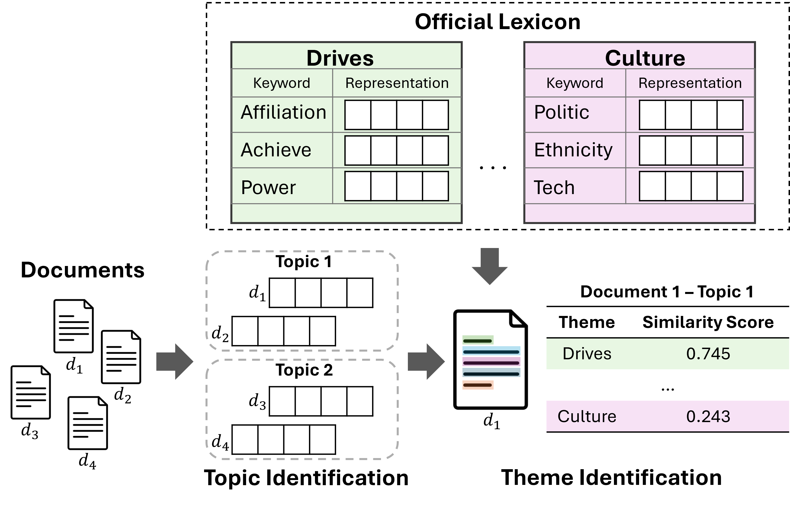

# SocioculturalThemeDetection: Detecting Sociocultural Themes Through Latent and Explicit Knowledge

## Overview
_SocioculturalThemeDetection_ is an NLP-based pipeline designed to analyze personal narratives in financial aid applications. The system extracts themes, computes sentence similarity, and visualizes emotional insights to support decision-making in scholarship evaluations. By leveraging machine learning and natural language processing, the project provides a structured approach to understanding applicants' experiences and emotional expressions.

This repository contains the code and data for the paper
**Detecting Sociocultural Themes Through Latent and Explicit Knowledge**.

 
<span style="font-size:16px;"><b>Figure 1:</b> An overview of our method</span> 


## Features
- **Text Processing**: Tokenization and embedding generation using `SentenceTransformer` and `AlephBERT`.
- **Topic Modeling**: Uses `BERTopic` and `HDBSCAN` to extract themes from narratives.
- **Emotion Analysis**: Leverages `hepsylex` psychological lexicons to compute emotional similarity.
- **Visualization**: Generates interactive charts to display emotional trends and topic distribution.

---

## Installation
To install the necessary dependencies, run the following command:

```bash
pip install -r requirements.txt
pip install pandas numpy torch sentence-transformers transformers bertopic hdbscan umap-learn plotly fastparquet
```

For GPU support:

```bash
pip install torch torchvision torchaudio --index-url https://download.pytorch.org/whl/cu118
```

---

## File Structure

- `main.py` → Runs the full pipeline.
- `figures.py` → Generates visualizations.
- `category.py` → Computes category-based embeddings.
- `Topics.py` → Extracts themes from documents and analyzes topics.
- `Sentence.py` → Tokenizes, embeds, and computes similarity.
---

## Usage
**Running the Pipeline**

To execute the complete pipeline, run:

```bash
python main.py
```

This script will:

1. Load the dataset from `20 Newsgroups` for English or `finaid_applications_2011_2024.xlsx` for Hebrew.

2. Compute sentence embeddings and similarity scores

3. Identify document topics using `BERTopic`

4. Merge topic and emotion data

5. Generate visual insights

**Output Files**
- `merged_data.parquet`: Contains computed emotions and topics.
- `documents.csv`: Stores processed documents with emotions and topics.
- Various `.html` visualization files for interactive analysis.

---

## Key Visualizations

### Emotion Semantic Score Distribution
 
<span style="font-size:12px;"><b>Figure 2:</b> Emotion Semantic Score Distribution over all the topics </span> 

### Heatmap of Themes vs. Topics
 
<span style="font-size:12px;"><b>Figure 3:</b> Heatmap for presenting the mean semantic score for topics and themes</span> 

### Emotion Trends Over Time
 
<span style="font-size:12px;"><b>Figure 4:</b> Emotional themes for the topic of youth movements over time based on the scholarship application dataset</span> 

---

## Future Improvements

Potential enhancements include:

- Expanding emotion lexicons for improved accuracy.

- Fine-tuning `BERTopic` parameters for better topic clustering.

- Integrating deep-learning-based emotion recognition models.

- Implementing a web-based interface for real-time analysis.

---

## License
MIT License.

## Citation
If you use this code or data, please cite our paper:

```bash
```
